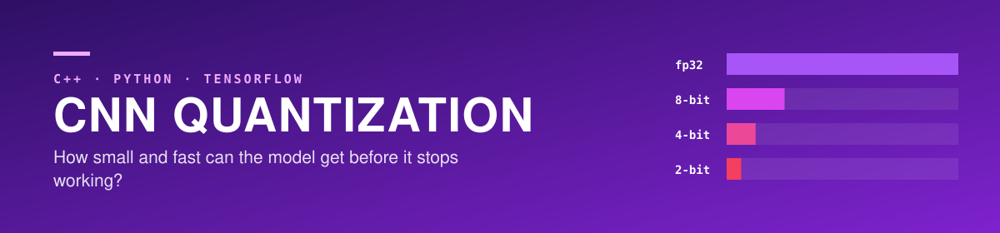
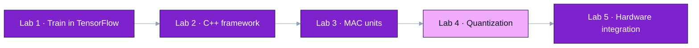
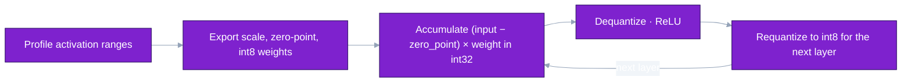
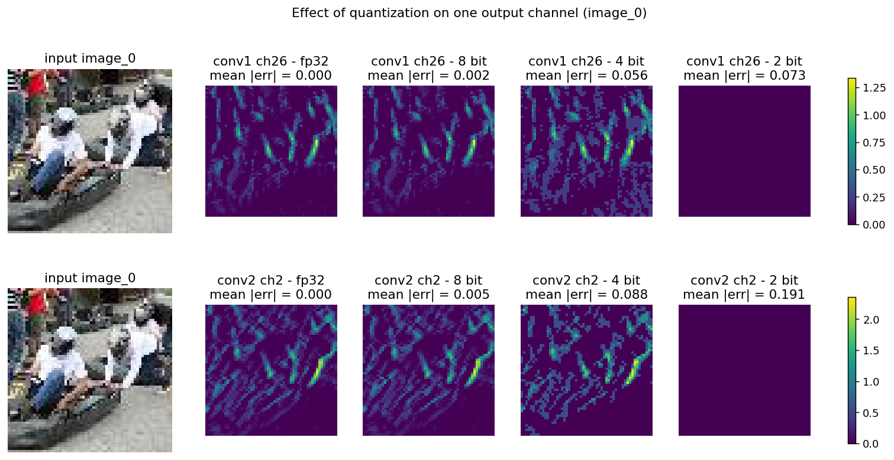

<div align="center">




Iowa State University · CprE 487/587 · Lab 4 · Team 06

[Why](#why) · [Where this lab fits](#where-this-lab-fits) · [My role](#my-role) · [Results](#results-lab-machine-1000-validation-images) · [Limitations](#limitations-and-next-steps)

</div>

---

> **Where it stands — Complete**  
> Post-training quantization of a TinyImageNet CNN at 8, 4 and 2 bits, in one C++ code base, measured on 1,000 validation images.  
> 8 bits keeps accuracy. 4 bits loses most of it. 2 bits is at chance level.

| 8-bit size | 8-bit latency | Top-1 · fp32 → 8-bit | Top-1 · 4-bit / 2-bit |
| :---: | :---: | :---: | :---: |
| **4× smaller** | **1.6× faster** | **23.5% → 23.8%** | **6.6% / 0.3%** |

| | |
|---|---|
| Period | September 27 – October 5, 2026 |
| Team | 2 — Zach Dixon, Jongwoo Kim |
| My role | All of the Lab 4 work in this repository: profiling scripts, quantized export, the integer inference path in C++, evaluation, and the report |
| Stack | C++, Python, TensorFlow/Keras, Jupyter, Make |
| Reports | [Lab 4 report (PDF)](submission/lab4_report_06.pdf) · [Lab 1 report (PDF)](lab1_06/Lab01%20Report_06.pdf) |
| Related | [Lab 2 — C++ framework](https://github.com/devjwk/cpre487lab2), [Lab 3 — MAC units](https://github.com/devjwk/cpre487lab3), [Lab 5 — hardware integration](https://github.com/devjwk/cpre487lab5) |

## Why

The fp32 model is about 3 MB and takes 143 ms per image on the lab PC. An embedded target has far less memory and no fast floating point. This lab measures how much size and time quantization saves, and how much accuracy it costs at 8, 4 and 2 bits.

## Repository layout

```
lab4/
  framework/     C++ framework (Lab 2 code + quantization), one code base for fp32 / 8 / 4 / 2 bit
  util/          notebook and helper scripts
lab1_06/         Lab 1 submission (notebook, exported weights)
lab2_src_06/     Lab 2 submission (fp32 C++ framework this lab builds on)
lab3_src_6/      Lab 3 submission (MAC unit)
```

## Build and run

```bash
cd lab4/framework
make clean && make build QUANT_BITS=8   # 32 (fp32), 8, 4 or 2; default is 8 (src/Config.h)
./build/ml          # framework tests; quantized builds also print per-layer error vs fp32 and top-1 checks
./build/ml val      # top-1 / top-10 accuracy and latency over the 1,000 validation images
```

Run `make clean` whenever `QUANT_BITS` changes. A quantized build loads `data/model/q<bits>/`, the fp32
build loads `data/model/*.bin`.

## Results (lab machine, 1,000 validation images)

| Model | Storage | Latency (avg) | Top-1 | Top-10 |
|---|---|---|---|---|
| fp32 | 3,081 KB | 142.9 ms | 23.5% | 60.5% |
| 8 bit | 773 KB | 87.6 ms | 23.8% | 60.4% |
| 4 bit | 773 KB (388 KB if packed) | 87.6 ms | 6.6% | 24.1% |
| 2 bit | 773 KB (196 KB if packed) | 87.8 ms | 0.3% | 4.6% |

4-bit and 2-bit values are stored in int8 containers, so their storage and latency match 8 bit.

## How the quantized inference works

1. `util/act_minmax.py` profiles each layer's activation range on 1,000 training images.
2. `util/quantize_export.py <bits>` computes per-layer input scale / zero-point and weight scale, and
   writes int8 weights, int32 biases and `quant_params.txt` to `framework/data/model/q<bits>/`.
3. In C++, each conv/dense layer accumulates `(input - zero_point) * weight` in int32, dequantizes,
   applies ReLU, and requantizes to int8 with the next layer's parameters. MaxPool and Flatten work
   directly on int8; the last dense layer outputs fp32 for the unchanged softmax.

## util scripts

| File | Purpose |
|---|---|
| `lab4_06.ipynb` | Lab 1 notebook extended for Lab 4 (activation profiling, validation export) |
| `weight_hist.py` | weight histograms and weight/bias min-max |
| `act_minmax.py` | activation min/max/avg -> `activation_ranges.json` (run in the notebook with `%run -i`) |
| `quantize_export.py` | quantized parameters for a given bit width |
| `export_val.py` | export 1,000 validation images and labels (run in the notebook with `%run -i`) |
| `plot_channel.py` | same output channel at fp32 / 8 / 4 / 2 bit -> `quant_channel_compare.png` |

The notebook needs the Lab 1 environment (`lab1_venv`) and `CNN_TinyImageNet.h5` next to it; the model
file is not tracked in this repository.

## Where this lab fits



## Quantized inference path



## My role

The Lab 4 commits in this repository are mine. `lab1_06/`, `lab2_src_06/` and `lab3_src_6/` are our earlier team submissions, included as the base this lab builds on.

- Profiled weight and activation ranges (`weight_hist.py`, `act_minmax.py`).
- Wrote the export script that computes each layer's scale and zero-point and writes int8 weights and int32 biases (`quantize_export.py`).
- Added the quantized inference path to the C++ framework (`Quant.h`, `computeQuantized` in the conv and dense layers) behind one build flag, `QUANT_BITS`.
- Added a validation mode (`./build/ml val`) and the script that exports 1,000 validation images.
- Wrote the report (`submission/lab4_report_06.pdf`).

## What I learned

**Technical**
- How scale and zero-point map a real range onto integers, and why accumulation must happen in int32 before requantizing for the next layer.
- Where accuracy collapses. At 2 bits, activations after conv2 round to zero and the network outputs a constant.
- Outliers set the scale. One dense-layer weight near −1.32 stretches the range for all the others.
- Memory is more than weights: allocating every layer's activations at once pushed the 8-bit model past a 1,000 KB budget, while reusing two buffers fits it.

**Teamwork**
- Making results reproducible on three machines (lab PC, GPU VM, laptop) with one repository and one build flag.
- Stating clearly in the report which numbers were measured and which were calculated.

## Resources used

- Sze, Chen, Yang and Emer, *Efficient Processing of Deep Neural Networks*
- Course DNN framework template and the Lab 4 handout
- TensorFlow/Keras and TensorFlow Datasets for the reference model and validation images

## Limitations and next steps

- 4-bit and 2-bit values sit in int8 containers, so they save neither space nor time over 8-bit. Bit-packing is needed to realize the 388 KB and 196 KB figures.
- 2-bit accuracy is at chance level. Per-layer precision (keeping early layers at 8 bits) is the next thing to try, and is part of Lab 5.
- The base model is weak (23.5% top-1), which limits what the comparison can show. Improving training was out of scope.
- Latency was measured on a desktop CPU. The ZedBoard numbers and the hardware MAC path come in Lab 5.

## Figure

Feature maps of the same channels at fp32, 8, 4 and 2 bits:


